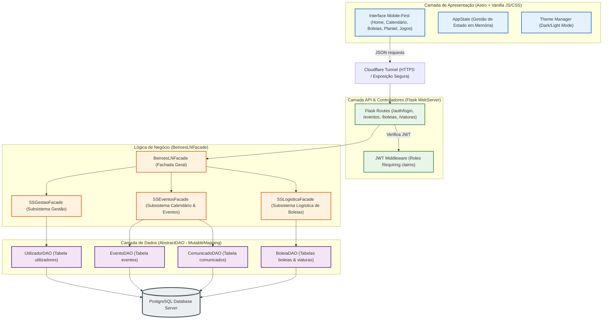

# Sistema de Gestão do Sport Clube "Os Beirões" ("O Caderno do Quim")
## Guia de Apresentação e Breakdown Técnico para Defesa do Projeto (LI4)

Este documento foi criado especificamente para a tua preparação para a defesa do projeto perante o docente (baseado no método do Prof. António Nestor Ribeiro e referências de Ian Sommerville). Ele sintetiza toda a engenharia de requisitos, decisões arquiteturais, detalhes de implementação e infraestrutura física, fornecendo os argumentos mais fortes para justificares as escolhas de design e programação.

---

## 💡 1. O Problema e Contexto ("Carolice" vs. Organização)
**O que explicar ao professor:**
O projeto resolve os problemas de um clube de futebol pequeno e provinciano (**Sport Clube "Os Beirões"**, na Vila de São Vicente da Beira), liderado pelo presidente **Sr. Joaquim "Quim" Barrela** e pelo treinador **Mister Zé**.
- **O Caos Original:**
  - **Gestão de Plantel:** Fichas de inscrição dispersas em dossiês de papel na sede, ficheiros Excel desatualizados em pens perdidas e dependência da memória do Mister Zé.
  - **Operação de Jogo:** Convocatórias informais por WhatsApp, onde as mensagens urgentes se perdem no ruído e os jogadores se esquecem das datas.
  - **Logística ("O Caos das Boleias"):** Jogos fora de casa planeados em cima da hora, dependendo da boa vontade de condutores voluntários (dirigentes/pais), resultando em carros sobrelotados, carros vazios e atletas esquecidos na praça da vila.
- **A Solução:**
  - O sistema funciona como o **"Caderno do Quim" digital e partilhado**. Uma aplicação leve, mobile-first, que remove a fricção e digitaliza a operação mantendo a simplicidade exigida pela baixa literacia digital dos utilizadores principais.

---

## 👥 2. Análise de Stakeholders (Seguindo Ian Sommerville)
Dividimos os intervenientes em três categorias claras:
1. **Stakeholders Internos (Operacionais e de Gestão):**
   - **Sr. Quim Barrela (Presidente/Dono):** Beneficia com a centralização dos dados (evitando multas por jogadores não inscritos) e canais de comunicação oficiais unidirecionais de alta prioridade.
   - **Mister Zé (Treinador):** Principal utilizador das ferramentas desportivas. Ganha controlo sobre assiduidade nos treinos e planeamento de convocatórias.
   - **Jogadores (Atletas):** Utilizadores finais que consomem calendário, respondem a convocatórias e reservam transporte.
2. **Stakeholders Externos:**
   - **Associação de Futebol Local:** Entidade reguladora cujas regras de inscrição e calendário o sistema ajuda a cumprir.
3. **Stakeholders do Processo de Desenvolvimento:**
   - **A vossa equipa de desenvolvimento:** Responsável por garantir as restrições de custo nulo e alta tolerância a falhas.

---

## ⚙️ 3. Engenharia de Requisitos (ISO/IEC/IEEE 29148:2018)
Evitámos ambiguidades comuns (como "Gerir Jogador" que é uma operação complexa e vaga) e dividimos o sistema em requisitos atómicos e específicos:
- **Requisitos Funcionais Nucleares (CRUDs bem definidos):**
  - **RF01 - Registo e Consulta de Jogadores:** Centralização com dados de contacto de emergência obrigatórios (ataca o risco de saúde/segurança em campo).
  - **RF05 - Convocatória Digital:** Associação direta a um Jogo, gerando um painel interativo simples para o jogador ("Vou" / "Não Vou").
  - **RF07 e RF08 - Oferta e Reserva de Boleias:** Registo de viaturas privadas, definição de lugares disponíveis e reserva atómica (com controlo de concorrência para evitar sobrelotação).
  - **RF09 - Publicação de Comunicados Oficiais:** Canal formal que isola avisos sérios do ruído do WhatsApp.
- **Requisitos Não Funcionais Críticos (RNFs):**
  - **Usabilidade (RNF01):** Filosofia Mobile-First, áreas de clique generosas (mínimo de 44x44px para dedos sujos ou no meio do campo), ícones grandes autoexplicativos.
  - **Eficiência de Custos (RNF04):** Orçamento nulo. Alojamento em infraestruturas caseiras com recurso a tecnologias eficientes e gratuitas.
  - **Resiliência e Confiabilidade (RNF05):** Atualização instantânea dos lugares vagos e controlo estrito de simultaneidade em reservas concorrentes (ex: se dois jogadores reservarem o último lugar do carro ao mesmo tempo).

---

## 🏛️ 4. Arquitetura do Software (ISO 42010)

### 4.1. Camada de Apresentação (Presentation Layer)
- **Tecnologias:** Astro Framework para estruturação de páginas reativas + Vanilla CSS e Vanilla JS para máxima flexibilidade e performance.
- **Client-Side Rendering (CSR):** Ideal para a experiência mobile d'Os Beirões. O carregamento inicial é rápido (peso total < 2MB), e as transições entre ecrãs (como sair do Calendário e entrar na Reserva de Boleia) ocorrem de forma instantânea sem requisições HTTP adicionais para as páginas físicas, proporcionando a experiência tátil de uma aplicação nativa.
- **Gestão de Estado (`AppState`):** Centralizada em memória e sincronizada de forma reativa com o `localStorage` para persistir o estado de sessão offline se a rede móvel 3G falhar temporariamente nas estradas da Beira Interior.

### 4.2. Camada de Lógica de Negócio (Business Logic Layer)
- **Tecnologias:** Python + Flask. Escolhida por ser um micro-framework extremamente rápido para prototipagem e leve no consumo de CPU e RAM (fundamental para correr na nossa infraestrutura física).
- **Padrão de Fachada (Facade Pattern):**
  - Implementámos uma fachada unificada (`BeiroesLNFacade`), que serve de ponto único de entrada para o servidor Web (Flask).
  - Esta fachada delega as operações para os três subsistemas isolados (`SSGestaoFacade`, `SSEventosFacade`, `SSLogisticaFacade`). Isto garante o **desacoplamento total** exigido nas boas práticas: se precisarmos de mudar o servidor web de Flask para FastAPI no futuro, a lógica de negócio permanece intacta.

### 4.3. Camada de Dados e Padrão DAO (Data Access Object)
- **Metodologia FastDL adaptada:** Cada subsistema interage com o PostgreSQL através de classes DAO específicas (`UtilizadorDAO`, `EventoDAO`, `ComunicadoDAO`, `BoleiaDAO`).
- **Pythonic Collection Abstraction (`MutableMapping`):**
  - **Decisão Genial de Design:** Fizemos a classe `AbstractDAO` herdar de `collections.abc.MutableMapping`.
  - Isto faz com que, para os subsistemas da Lógica de Negócio, as tabelas da base de dados se comportem **exatamente como dicionários padrão de Python**.
  - Exemplo em código: `self.boleias[str(nova_boleia.id)] = nova_boleia` executa automaticamente a query SQL `INSERT` ou `UPDATE` sob o capô, enquanto `del self.boleias[boleia_id]` executa o `DELETE`.
  - **Por que justificar isto ao professor?** Isto simplifica a legibilidade da lógica de negócio, remove a necessidade de escrever queries SQL SQL no meio dos algoritmos de negócio e permite isolar/substituir o motor de base de dados facilmente (teste em memória com dicionários simples vs. persistência no PostgreSQL).

---

## 🗄️ 5. Base de Dados Relacional (PostgreSQL)
- **Tabelas Principais:**
  - `utilizador`: Contém a especialização de papéis (Dirigente, Treinador, Jogador) numa única tabela unificada com campos condicionais (como `licenca` para treinadores ou `posicao` para jogadores). As passwords são armazenadas em `bytes` (armazenando hashes cifrados via bcrypt/pbkdf2).
  - `evento`, `treino` e `jogo`: Modelagem da herança utilizando tabelas secundárias com chaves estrangeiras.
  - `viatura`: Registo de veículos associados a um `proprietario` (relação 1:N).
  - `boleia` e `passageiros_boleia`: Tabela de associação (N:M) que liga os jogadores convocados que necessitam de transporte às viaturas disponíveis, com **ON DELETE CASCADE** configurado para limpar as reservas de passageiros de forma automática caso uma viatura se avarie ou uma boleia seja cancelada.

---

## 📡 6. Infraestrutura Física e Operacional (Physical View)
- **Servidor de Produção Local (On-premise):** Raspberry Pi instalado na sede do clube.
  - **Justificação:** Custo único de aquisição (cerca de 50€), consumo elétrico nulo (cerca de 5W, custa menos de 10€ por ano para manter ligado 24/7), evitando faturas de serviços Cloud como AWS ou Azure que seriam insustentáveis para Os Beirões.
- **Gunicorn (WSGI Server):** O servidor interno de desenvolvimento do Flask não é seguro nem concorrente. O **Gunicorn** atua como servidor de produção para gerir múltiplos acessos simultâneos (especialmente ao domingo de manhã, quando todos os atletas tentam ver se têm boleia ao mesmo tempo).
- **Cloudflare Tunnel (O trunfo da rede):**
  - **O Problema:** A rede da sede do clube tem um IP dinâmico (muda constantemente) e está sob **CGNAT** (o ISP não permite abrir portas `80` ou `443` no router doméstico).
  - **A Solução:** Um daemon do Cloudflare corre no Raspberry Pi, abrindo uma ligação de saída persistente para os servidores da Cloudflare.
  - **Os Benefícios:** Permite expor a API de forma 100% segura para o exterior sem abrir qualquer porta no router da sede. Garante encriptação **HTTPS/SSL gratuita** automática e protege o servidor contra ataques de negação de serviço (DDoS).

---

## 💾 7. Política de Backups e Disaster Recovery (Princípios de Ian Sommerville)
Como o Raspberry Pi utiliza cartões SD (que se degradam com facilidade devido a constantes ciclos de escrita), desenhámos uma política de cópias de segurança robusta:
1. **Minimização de Escritas:** O sistema minimiza a escrita de logs em disco (mantendo logs leves em memória) para prolongar a vida útil do cartão SD.
2. **Esquema Híbrido de Backups (Automático):**
   - **Backup Local (Snapshot):** Todos os dias às 03:00 AM, um script cron executa um `pg_dump` da base de dados PostgreSQL, comprime em `.tar.gz` e guarda numa Pen Drive USB física ligada ao Pi (isolando os dados se o cartão de boot avariar).
   - **Backup Remoto (Off-site):** O ficheiro comprimido é imediatamente enviado de forma automática para uma conta cloud gratuita (Google Drive associado ao clube) usando a ferramenta **Rclone**.
3. **Plano de Disaster Recovery (RTO < 2 Horas):**
   - Se o Raspberry Pi queimar ou for roubado, o processo de recuperação consiste em gravar a imagem base do sistema num novo cartão SD, instalar os contentores Docker e executar o `pg_restore` do último backup diário retirado da cloud. O tempo de recuperação estimado de paragem do sistema (RTO) é inferior a duas horas.

---

## 🧪 8. Automação e Qualidade de Software
Diferenciador enorme para mostrar na defesa: o projeto tem um pipeline de **CI/CD e testes automáticos integrados**.
- **Duplo Ambiente de Base de Dados:**
  - `caderno_quim`: Base de dados de produção.
  - `beiroes_test`: Base de dados secundária, isolada para testes automáticos, garantindo que os dados de teste não poluem a base real de produção.
- **Deploy Script Automatizado (`local_deploy.sh`):**
  - Puxa o código mais recente do Git.
  - Sobe o contentor da base de dados `beiroes_db` de forma isolada em Docker.
  - Executa as suites de testes de integração (`auto_test_all.py` que corre os testes das fachadas de Gestão, Eventos e Boleia) apontando para a BD de teste.
  - **Passo Crítico:** Se os testes passarem com sucesso, o script compila a nova versão da API, sobe a aplicação em produção e corre o script de povoamento (`populate_database.py`) para popular o sistema com dados coerentes de demonstração (atletas reais, jogos e comunicados simulados). Se algum teste falhar, o deploy é imediatamente abortado, mantendo a produção estável.

---

## 🏆 9. Dicas e "Talking Points" Críticos para a Apresentação
Quando estiveres a defender o projeto, foca-te nestes 4 argumentos para ganhar a simpatia dos professores:

1. **"O sistema não é apenas um CRUD genérico, é um sistema sócio-técnico":**
   * *O que dizer:* "Senhor Professor, baseámo-nos nos ensinamentos de Sommerville para perceber que a maior barreira de adoção é a literacia digital dos utilizadores (Sr. Quim e Mister Zé). Por isso, desenhámos a interface em torno de inputs atómicos (dois botões gigantes 'Vou' ou 'Não Vou', checklists rápidas de assiduidade de um clique) para reduzir a carga cognitiva."
2. **"Usámos o Padrão Facade para desacoplar a arquitetura":**
   * *O que dizer:* "Separamos rigorosamente a Apresentação (Astro + Vanilla JS) da Lógica de Negócio (Flask) através da nossa `BeiroesLNFacade`. Isto permitiu que desenvolvêssemos as duas equipas em paralelo. A API comunica apenas em formato JSON e valida tokens JWT contendo as permissões de acesso (claims) no cabeçalho das chamadas."
3. **"O nosso DAO comporta-se como uma coleção nativa de Python":**
   * *O que dizer:* "Para manter a lógica de negócio limpa e independente do dialeto SQL do PostgreSQL, herdámos os nossos DAOs de `MutableMapping`. Isto abstrai o acesso aos dados na perfeição. Para a lógica de negócio, aceder ao banco de dados é tão simples como aceder a um dicionário em memória."
4. **"Temos resiliência física com um custo de manutenção zero":**
   * *O que dizer:* "Para contornar o orçamento zero do clube, alojamos a aplicação num Raspberry Pi on-premise. Configurámos Gunicorn como servidor WSGI de produção. Resolvemos os problemas de IP dinâmico e CGNAT através de um Cloudflare Tunnel seguro e criámos uma rotina diária automática que extrai o snapshot da base de dados para uma pen física e envia de forma redundante para a cloud via Rclone."
